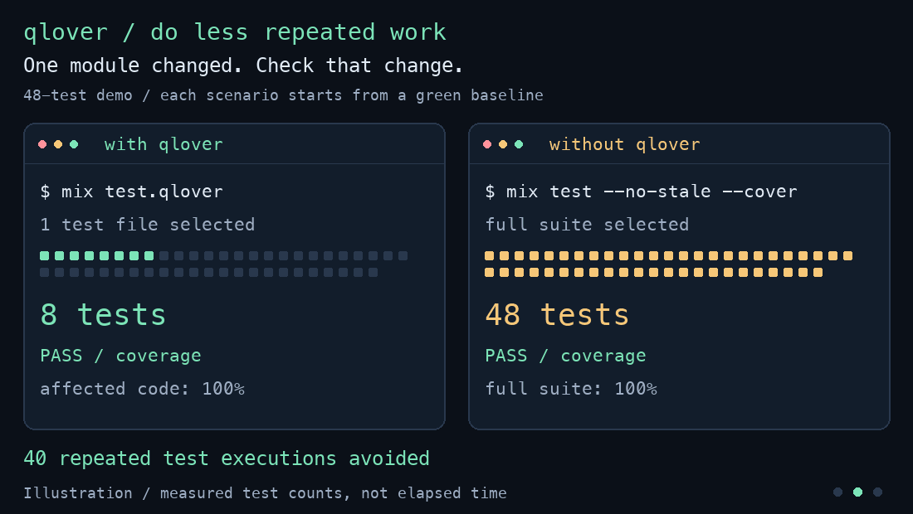

# qlover



## Install

```elixir
# mix.exs

defp deps do
  [
    # Your existing dependencies...
    {:qlover, github: "qforge-dev/qlover", only: :test, runtime: false}
  ]
end

def project do
  [
    # Your existing project settings...
    test_coverage: [summary: [threshold: 100]],
    elixirc_options: [tracers: qlover_tracers()],
    test_elixirc_options: [tracers: qlover_tracers()]
  ]
end

def cli do
  [preferred_envs: [qlover: :test, "test.qlover": :test]]
end

defp qlover_tracers do
  if Mix.env() == :test, do: [Qlover.Tracer], else: []
end
```

Run: `mix test.qlover`

## How much work can you skip?

**Stop paying for the same test run.**

Your tests passed. You changed one file. Why run everything again?

qlover is an incremental test runner and **100% line-coverage gate for
Elixir**. It remembers a passing coverage baseline, runs the tests needed
for your changes, and checks the affected code again. Less repeated work,
less waiting, less compute spent proving what you already know.

Measured in the [48-test demo](examples/demo), comparing a full
`mix test --no-stale --cover` run with `mix test.qlover`:

| Change | Without qlover | With qlover | Test executions avoided | Result, both |
|:-------|---------------:|------------:|------------------------:|:-------------|
| First run, no baseline or cache | 48 | 48 | 0% | Pass |
| Run again, nothing changed | 48 | **0** | **100%** | Pass |
| Refactor one module | 48 | **8** | **83%** | Pass |
| Edit one test file | 48 | **8** | **83%** | Pass |
| Add a module and 5 covering tests | 53 | **5** | **91%** | Pass |
| Implement a feature with 3 new tests | 51 | **3** | **94%** | Pass |
| Add code that the tests never cover | 49 | **1** | **98%** | Coverage fails |

**The first run earns the baseline. Later runs reuse it.** The zero-test
row is an unchanged rerun, not a free first run.

These are test-execution savings, not wall-clock speedup percentages.
Startup, compilation, and coverage checks still take time; the time saved
depends on how expensive your tests are. The animation illustrates these
counts after a green baseline; its playback is not a timing benchmark.
[Still image](docs/assets/comparison.png) · [All results and reproduction](examples/demo)

## Why qlover exists

A full test run is valuable when it tells you something new. Repeating the
same checks after an unrelated edit spends time and compute answering a
question you already answered.

That cost repeats throughout the day: every save-and-check loop, every
worktree, every agent asking whether its change is ready. The goal is to
make the amount of test work follow the size of the change, rather than
the size of the whole project.

Coverage makes this harder. Running a small subset with ordinary
`mix test --cover` can make an otherwise fully covered project look
incomplete: the other tests simply did not run. A strict coverage
threshold then sends you back to the entire suite.

qlover keeps a record of the coverage already established and asks for
fresh evidence where something changed.

## How it works

1. **Establish a baseline.** Run the full suite and meet the 100% coverage
   threshold. qlover remembers the compiled code, test files, and their
   references.
2. **Look for changes.** On the next run, compare the current project with
   that baseline. If nothing relevant changed, no tests need to run.
3. **Run the affected tests.** Select the relevant test files and collect
   fresh coverage. Editing or deleting a test can also require code to be
   checked again.
4. **Keep the coverage requirement.** Code needing a new check must reach
   100% in the fresh run. Old coverage cannot fill gaps in changed code.
   A test or coverage failure stops the run; a successful check advances
   the baseline.

Changes to configuration, dependencies, migrations, or test fixtures can
trigger a full run. Missing reference data for changed tests also falls
back to the full suite.

Requires Elixir 1.18 or newer and a **100% coverage policy**. Ordinary
`mix test` and `mix test test/my_test.exs` remain available for your usual
test workflow.

Selection uses recorded module references. Dynamic calls, protocol
dispatch, and external inputs outside the tracked paths can escape that
map. For changes involving those, use a full check:

```sh
mix test --no-stale --cover
```

## Reuse the work across worktrees

A new checkout does not always need to repeat a full run. If identical
project content already has a passing baseline in the shared cache,
qlover can reuse it after compiling locally.

The cache defaults to `~/.cache/qlover` (or `$XDG_CACHE_HOME/qlover`). Point
worktrees at the same directory to share it:

```sh
export QLOVER_CACHE_DIR="$HOME/.cache/qlover"
mix test.qlover
```

The full run still happened somewhere. A cache hit reuses that result;
changed content still needs a new check. Agents on separate machines need
access to the same cache directory to share it. Set `QLOVER_CACHE_DIR=""`
to disable sharing.

## Try the comparison

From a clone of this repository:

```sh
cd examples/demo
QLOVER_CACHE_DIR="" ./compare.sh
```

The script establishes a full baseline, applies independent changes, and
compares qlover with full coverage for each one. It prints test counts and
pass/fail results, and exits unsuccessfully if the verdicts disagree.

[Demo and full results](examples/demo) · [Changelog](CHANGELOG.md) · [Apache-2.0 license](LICENSE)
